KKaffeedetect
====

This is a collection of tools to support the following workflow:

1) Download images specified in CSV file (already prepared twitter links)
1) Detect the shapes of the hand-drawings in the downloaded images and store the outlines into an editable format (SVG)
1) Crop the shapes from the SVG Files from the images 
1) as a sideproduct "tweened" or interpolated images between two given files can also be generated if this is usefull in follow-up processing in Video Sequence Editors etc.

Step 2 uses OpenCV (https://opencv.org/) for basic image processing.

This is by no means intended as any form of tutorial and not a propper way to do things with opencv.
The code provided might also not comply to most PEP standards.
I have some experience in python and numpy but I had no idea what I was getting into when trying to solve this in the first place. 
It may serve however for a future me as a reference for my thought process and might help someone starting with image processing to check the tought process of others.


Motivation
=======
An artist that I use to watch regularly on twitch is drawing tiny cartoonish pictures with ink and watercolor.
She frequently publishes them on twitter and sends them to followers as gifts.
On stream the idea was discussed to have a "flip book" kind of animation of these images.
Since most of the images are not available anymore to herself the only reference are the twitter uploads.
It would be a tedious task to download and crop all of them manually.
A member of her community "Peldon" already created a tool to collect tweets published with a given tag - this tool can be found here:
https://github.com/Peldon/KritzelKaffeeArchivar

It generates a CSV file of all tweets found via the twitter API for cataloguing purposes and reference of drawn characters.

The programs in this repository can help you to get from source images that have a "drawing" in them like these:

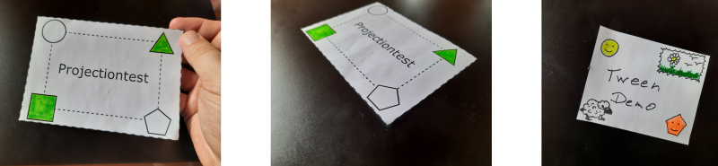


via an automatic shape detection with the option to manually correct (center image)

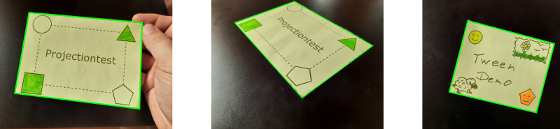

to cropped images (for different styles of cropping see below)

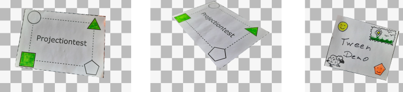

which then can be tweened and used to generate animations like these (via software like Blender or ffmpeg): 


Environment Setup
===================

You will need a working python (3.7 or newer) environment with numpy and opencv to use the tools provided here.

It is recommended to create a Virtual (venv) environment
for a more complete reference please check https://packaging.python.org/guides/installing-using-pip-and-virtual-environments/

All cmd-line snippets here assume that you are in the directory where you cloned this repository into.

They should work equivalently if using powershell on windows and any bash compatible shell.

```
> python -m venv ocvvenv
> source ./ocvenv/bin/activate 
> python -m pip install -r requirements.txt
```
For windows the second line should be
```
> ./ocvenv/scripts/activate 
```

If you are like me - try to remember to activate your venv when you restart you working session :)


Usage
===================

Each proceess step has a output directory

- 01_downloaded_tweetimgs   tweetimgdownloader.py can be used to populate the base tweet images in this directory
- 02_shapedetected_imgs     svgcreator.py can be used to read in files from 01_downloaded_tweetimgs and convert them into a svg with a path in it that is determined by the shape detection algorithm
- 03_shape_verified_imgs    this directory should be manually populated with checked shapes from 02_shapedetected_imgs
- 04_cropped_imgs  svgcrop.py can convert a svg image with a path from 03_shape_verified_imgs  into pngs where the paths shape is cropped out from the rest of the image and the "background" blackended out/set to transparent
- 05_tweened_sequence_imgs tweensvggenerator.py is used to generate frames that "warp" or "tween" between two source SVG files (or multiple) - note that in fact the "cropping" step can be skipped and the files from 03_shape_verified_imgs be used as is to do this if wanted.


The overall process depending on what you want to produce can deviate.


Downloading
-------------------

This Repository contains three sample files. If you want to use the dataset it was intended to process you can download the files necessary with:
```
> python tweetimgdownloader.py sampledata.csv 01_downloaded_tweetimgs
```


Shape Detection and Conversion to SVG
--------------------------------------

```
> python svgcreator.py 01_downloaded_tweetimgs/test* 02_shape_detected_imgs --scale=20

01_downloaded_tweetimgs/test_20200514_01.jpg => 02_shape_detected_imgs/test_20200514_01.jpg.svg
...
```

To see the algorithm "at work" you can use the following:

```
> python svgcreator.py ./01_downloaded_tweetimgs/test_20200514*.jpg ./02_shape_detected_imgs --showimages --showprocessteps --scale=20
```
Note: the "scale" parameter only affects the displayed output - the image is still preserved in its original scaling.

The second Image does not meet the algorithms requirements for detection because it assumes that the shape is a quadrangle that is close to a rectangle in the center of the image. Therefor the output will be rather bad.
Since not all images can be recognized really the manual fixing process is necessary and can easily be achieved by processing the shapes in the SVG file.


Cropping
--------------------


The following Figure shows the three source images (centered with corrected shape) resulting from commands shown below (in order simple cropping, zoomed, projected to rectangle with guessed aspect).

Disclaimer: the implementation of the projected variant was found here: https://stackoverflow.com/questions/38285229/calculating-aspect-ratio-of-perspective-transform-destination-image code was generously provided under the Creative Commons Attribution-ShareAlike 4.0 license. 


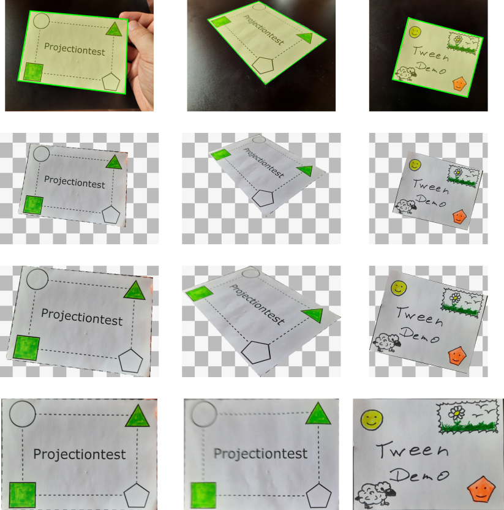


```
> python svgcrop.py 03_shape_verified_imgs/test_*.svg 04_cropped_imgs --autosuffix
03_shape_verified_imgs/test_20200514_01.jpg.svg => 04_cropped_imgs/test_20200514_01.jpg_cropped.png
...
```

```
> python svgcrop.py 03_shape_verified_imgs/test_*.svg 04_cropped_imgs --zoom --autosuffix
03_shape_verified_imgs/test_20200514_01.jpg.svg => 04_cropped_imgs/test_20200514_01.jpg_zoom.png
...
```

```
> python svgcrop.py 03_shape_verified_imgs/test_*.svg 04_cropped_imgs --projected --autosuffix
03_shape_verified_imgs/test_20200514_01.jpg.svg => 04_cropped_imgs/test_20200514_01.jpg_projected.png
...
```


For continued processing the output can be set to SVG
```
> python svgcrop.py 03_shape_verified_imgs/test_*.svg 04_cropped_imgs --autosuffix --outputtype=svg
```

Tweening
----------
The sample tween images that you can find in this repo have been generated as follows (Note the optional second optional file glob which is appended to create the cyclic loop):

```
 > python tweensvggenerator.py 04_cropped_imgs/test_20200514_*.svg 04_cropped_imgs/test_20200514_01.jpg_cropped.svg 1920x1080 --frames=5 --stillframes=2 -o ./05_tweened_sequence_imgs/
```

The frames parameter defines how many frames are generated in the transition of one image to the next. Stillframes defines how often the last frame is repeated. For the animationloop shown in the gif-file above both values were set to 60 and the rendering software was set to 30fps.


Technical details & thought process
================

Computer vision and related tech like "AI" based image processing (in most cases neural networks at the end of the day) are all the buzz at the moment. So when I was faced with the intention of "finding a roughly rectangular drawing in a picture" I was expecting to find something that works out of the box. In the end whe have self-driving cars and dreaming AIs producing images of [pigsnails](https://photos.google.com/share/AF1QipPX0SCl7OzWilt9LnuQliattX4OUCj_8EP65_cTVnBmS1jnYgsGQAieQUc1VQWdgQ?key=aVBxWjhwSzg2RjJWLWRuVFBBZEN1d205bUdEMnhB), so this should be a trivial one. Well it seems there are no "out of the box" solutions just yet.

So I tried to take a crack at it by using opencv and unfortunately the results were still rather disappointing:

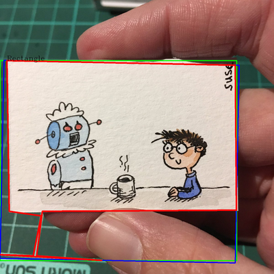

The red shape is what opencv detected as a contour, the blue line is the "optimized minimal box keeping the overall directions of the edges" and the green box is the rough rectangle that I made up to estimate the drawings outline. 

Turns out that the "shape detection" of opencv (cv2.findContours) isn't giving us the drawing in the picture "for free". Even after "cleansing" the original image from greens (cutting/painting mat) and fingers by just removing these colours (pale redish pink?) and transforming it to a greyscale that opencv edge/shape detections can work with, it seems the algorithms can not be limited to only shapes with corners of certain angles (~90 degrees), a maximum amount of corners (4) and to ignore noise (see those pesky measuring lines of the painting mat?).

The "canny edge" detection discussed at several places didn't get me anywhere. And at that point I didn't know about cv2.HughLines http://homepages.inf.ed.ac.uk/rbf/HIPR2/hough.htm or cv2.Harris.
When I was essentially done with my "hammer and chisle" approach (ok maybe flintstone) my wife started to solve a jigsaw puzzle and I was wondering (since this would be a simmilar problem) if someone ever tried to build a jigsaw puzzle solving assistant. Turns out Riccardo Albertazzi did: https://towardsdatascience.com/solving-jigsaw-puzzles-with-python-and-opencv-d775ba730660 and I learned a ton from reading his article and digging through his code giving me a lot of ideas of what I might try in the future and what I could have done different. But lets not get stuck in hindsight.

After hitting a wall playing around with "best practice" approaches - since sometimes the findContours was so off that even the basic idea of "get good 90 degree angles and get the longest lines to make a good guess about the rectangle of the image" failed so hard I went back to an idea that I had even before touching opencv at all. Scan for the corner by doing a search for the edge by finding a "drop or increase" of a grey scale images intensity.

Hammer time!
-----------------

When a computer-vision-caveman can't get the sonic-screw-driver things of opencv to work as intended, he goes back to the tools he knows. He just takes a hammer (simple numpy code) and hits the rock (image) so hard with it until the marble block (drawing) in the middle is set free from the granite surrounding it!

Overall we are looking for the "white canvas" of the drawing.
So the initial idea was to guess that the drawing is pretty much at the center and to have 4 squares growing from that center to the outside by small rectangular areas until the new rectangle is made up mostly by "black" pixels.
But looking at a sample image (reduced of the finger, background etc in black and white):


It quickly becomes obvious that this will fail in most cases with bad results, because the figures of the image are coloured and will therefore be blackened out. Growing from the inside out will hit the "black wall" of the character on the right. 

But it turns out that working from the outside to the inside works quiet well:

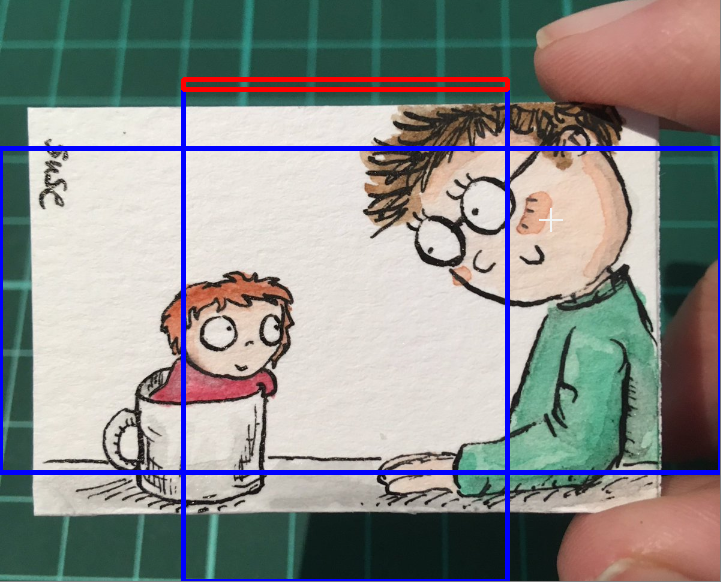

Note that the algorithm still does all the calulation on the black and white image from before - but having it shown on the original coloured image is well... more "visually appealing".
The red box is the area which is checked if it mostly consists of white pixels - if so we stop and assume this to be the top edge of the drawing.

The result of this process leaves us with 4 edges which cornes give us the result below (blue line). Green is the assumed inner part of the image (4% offset) and red is a (7% offset) both are not used anymore in further processing but they look fancy :). 

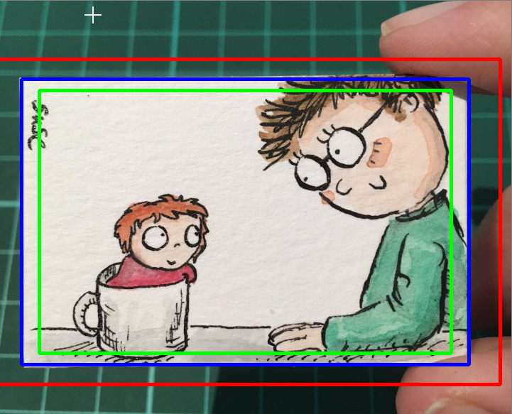

So that leaves us with... a rough rectangle... which is not really what we wanted so we need to refine it...

We can do better for chisle! 
---------------------------

Out of the rough block of marble cut out from the raw picture we take our chisle and craft something useful (shrinkoptcut.get_optimized_rect). 

For every corner of our rectangle we see if a triangle made up by that corner and the two adjacent corners would match more closely our targeted shape. Essentially we check if most of the triangle is made up by black or white - if it is black we push the corner "inward" if it is white we push it "outward" - for more complete explanation please see the coding - but I think watching the process gets the idea across best:


this of course can fail if the fragments around our original box are still very noisy.


(For the serious people who don't get the pun in the title of this section and lived under a rock for the last 20 years: It is a play on the slang "forshizzle ma nizzle" (google E-40  and Snoopdog!) and a reference to the hammer and chisle analogy before - yes I am kinda counting on the fact that you might have read all this from top to bottom... which is a long shot - I know - but you have to aim for something right?)

Cleaning up the desk....
------------------------------

There is one more point that is kind of annoying. In some cases the shrinkbox method does terminate too quickly because there are white things in the background: Paintboxes and paper tissues. For better results and less manual processing I wanted to get rid of them. 

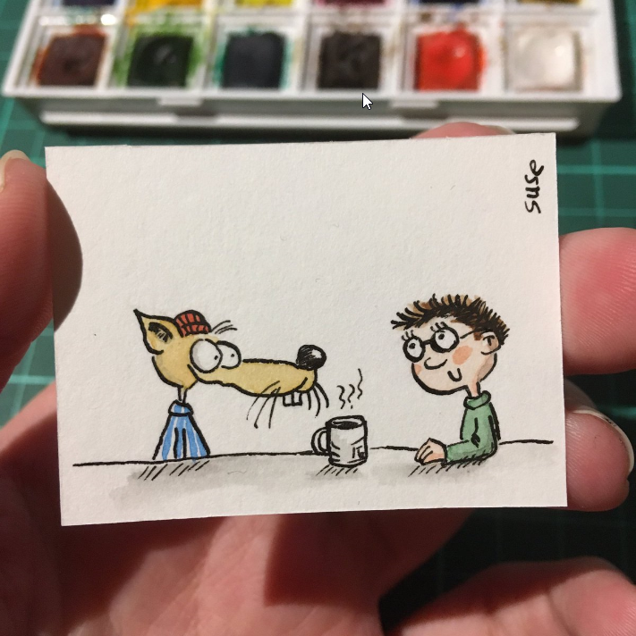

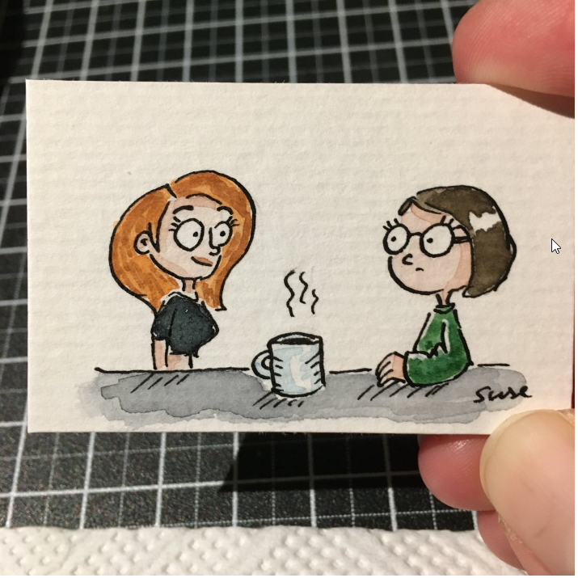

On the way from pure opencv approach to the shrinkbox appoach I tried to create what I call "grey smear images" which at the end of the day led to nowhere but came in handy now. It calculates the average pixel value by summing the average pixel value of the line and column the pixel is in.

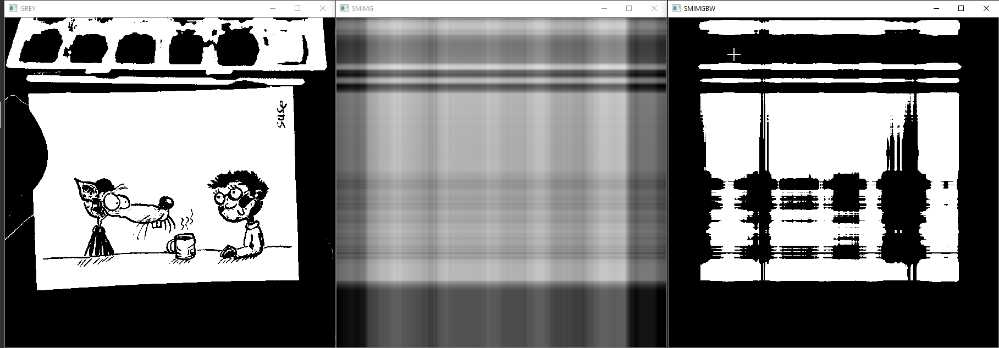

While this doesn't help us with any other processing itself we can use it to find the biggest white block (the drawing) and blanking out the others. To find out what works well as a grey image and a decent cut-out value I wrote plotgreyvert.py and played around with some values to get a binary signal indicating white areas.

In the middle row you see in blue the average grey value of the image above. Red is the calcualted cut-off value. Green shows the drop from absolute average grey (127) to black (0). Below you see the "binary signal" derived from the cutoff line (red) (grey above cutoff = 1 grey below cutoff = 0). The Biggest white area is ignored and the others cut away from the source image.

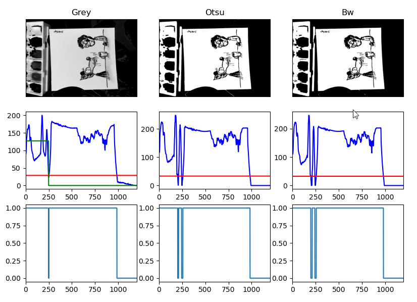

With this approach the shrink detection works signifficantly better than before altough there are still some cases where the paintboxes (and other objects) can not be detected by this method. As a runtime improvement we could choose the cutout-points as starting points for the shrinkbox method but I didn't go that far.


Summary
-----------
I have learned a ton on this journey and I had a lot of fun! One of the nicest discoveries that I will use for sure was http://docopt.org for command line parameter processing - imho this is much better than argparse or anything else out there!
Obviously I also learned a ton about numpy and opencv and had the opportunity to get a refresher of my rusty vector calculus which I can use in the future for sure.

One thing that I might add soon is a "Suse detector" by using the grey smear images to find the character on the right hand side of a projected image. One might create a "Susevolution flipbook" animation from this. 

I might get tempted to play around with the Harris edge detection in the future to see if I get equal or better results by finding long edges with it and intersecting them to find corners, or see if Riccardo Albertazzi's approach to corner detection works for this dataset.

The resulting dataset as it is now might also serve to use it with YOLO https://towardsdatascience.com/yolo-you-only-look-once-real-time-object-detection-explained-492dc9230006. This could serve as a "real time kritzelkaffe detector".

Whenever I decide to go down one of these rabbit holes I will upload my results and link them here.


Disclaimer
===================

All images downloaded via the sampledata.csv file or otherwise hand-drawn pictures shown here are copyright by Susanne Stiller you can contact her on twitter https://twitter.com/datGestruepp or via her private page http://susanne-stiller.de/ . Usage of these pictures was granted solely for the purpose of illustration of this documentation. Copyright of shown Characters remain with their respective owners. 


The implementation of the perspectively correct projection with size estimation is not my own
but was found here https://stackoverflow.com/questions/38285229/calculating-aspect-ratio-of-perspective-transform-destination-image
unfortunately there is no license mentioned with the code therefore the right remains with the original author.
libkaffeedetect.get_scaled_image_keeping_aspect(img_process, shape)


